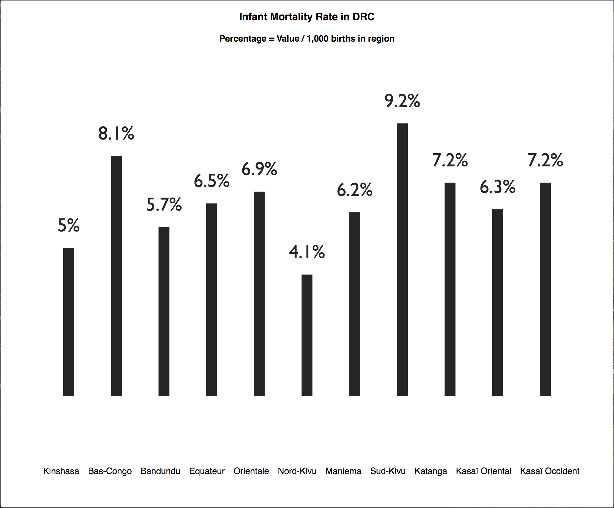
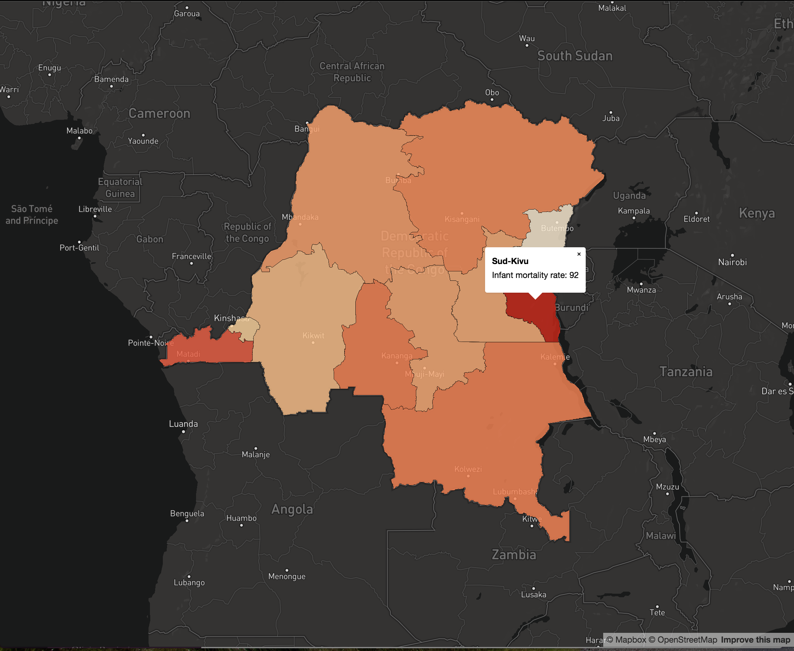

# JavaScript Maps 101
Lightning Talk on JavaScript Maps for DCJS Meetup

## Why Make This...

## When You Can Make This!

#### Note: Value in Map is RAW Value (i.e. 92 deaths per 1,000 births)

## Storytelling With Geospatial Data:

- Both graphics above render the same data from: https://api.dhsprogram.com/rest/dhs/data?breakdown=subnational&indicatorIds=CM_ECMR_C_IMR&countryIds=CD&surveyIds=CD2013DHS&returnGeometry=true&f=geojson
- Rendering data on a map often tells a richer story than a chart alone, because the user can see the geographic relationship of the data and how geography can affect the data

## Popular JavaScript Map APIs:
- Esri ArcGIS API for JS: https://developers.arcgis.com/javascript/latest/api-reference/index.html
- Mapbox GL JS API: https://www.mapbox.com/mapbox-gl-js/api/
- Google Maps API: https://developers.google.com/maps/documentation/javascript/
- Leaflet JS Library: http://leafletjs.com/

## geoJSON = JSON + geometry:
- geoJSON Intro: http://geojson.org/geojson-spec.html#introduction
- Convert to geoJSON/Map geoJSON: http://geojson.io/
- There is also topoJSON (which has smaller file sizes than geoJSON of same region because topoJSON reduces repetition in overlapping geometry): https://github.com/topojson/topojson

## Shameless Plug: The DHS Program Indicator Data API offers free-to-access, geoJSON data from 90 countries and 300+ surveys!
- API Home: https://api.dhsprogram.com
- Query Builder: https://api.dhsprogram.com/#/api-querybuilder.cfm
- Sample Query: https://api.dhsprogram.com/rest/dhs/data/KE2014DHS,FE_FRTR_W_TFR,subnational?f=geojson&returnGeometry=true
